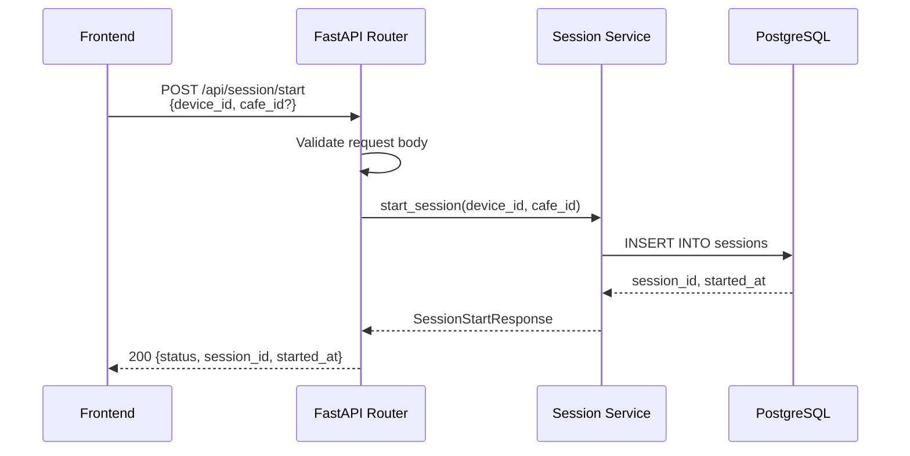
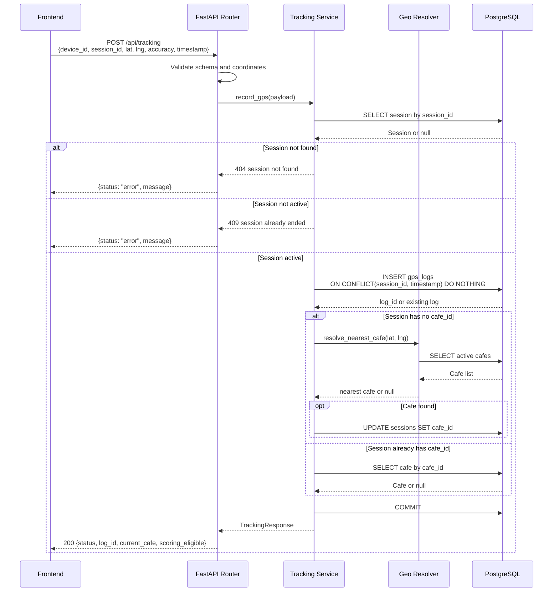
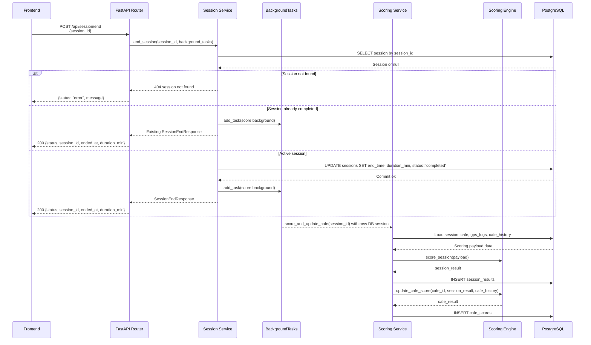
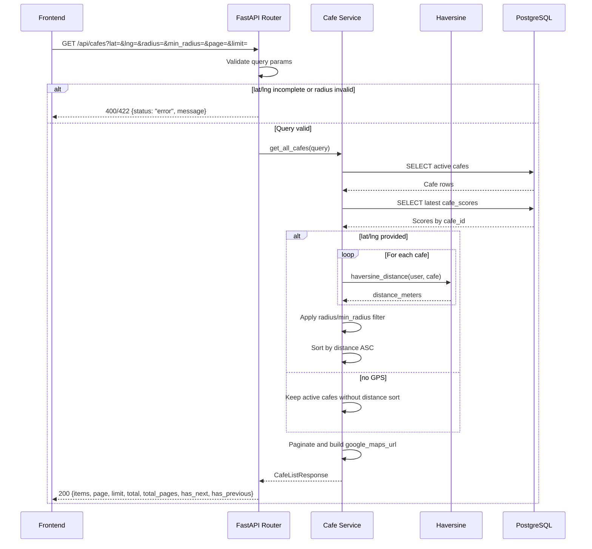
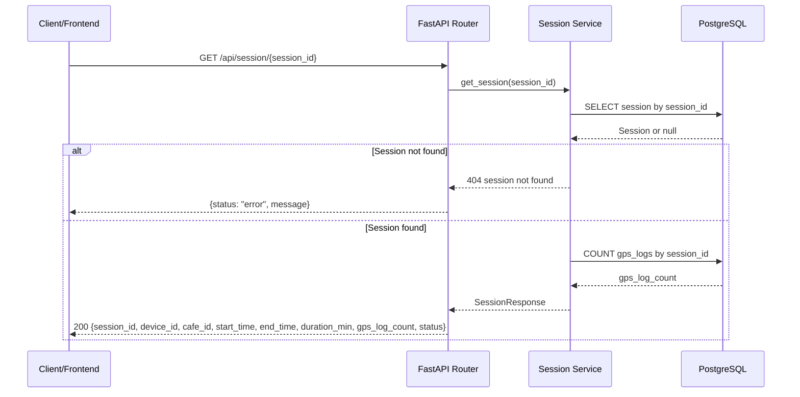
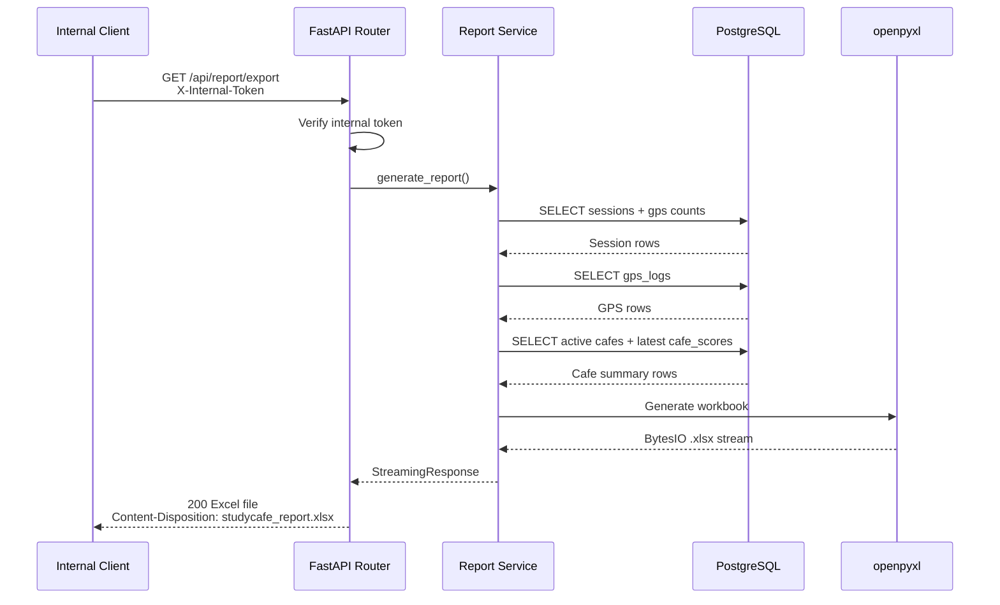
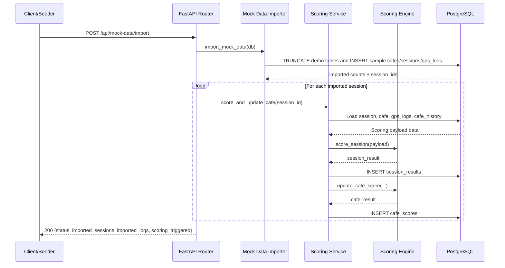
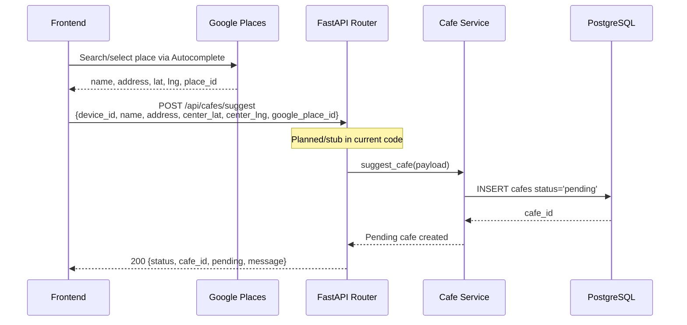
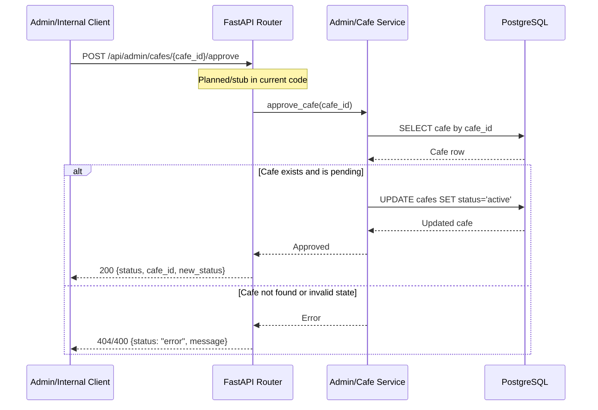

# API Design Document
## StudyCafe Analytics System

**Phiên bản:** v1.3
**Ngày cập nhật:** 06/05/2026

---

## 1. Mục tiêu tài liệu

Tài liệu này mô tả thiết kế API và contract giao tiếp giữa frontend, backend, database và scoring engine trong hệ thống StudyCafe Analytics System.

Mục tiêu của tài liệu:
- Chốt endpoint để code backend/frontend không lệch nhau.
- Chốt request/response schema.
- Chốt error handling cơ bản.
- Chốt contract dữ liệu mà backend sẽ cung cấp cho scoring engine và nhận lại kết quả.

---

## 2. Nguyên tắc thiết kế API

- Ưu tiên đơn giản, dễ demo, dễ tích hợp.
- Prefix thống nhất: `/api/`
- Dữ liệu trao đổi ở định dạng JSON, trừ API export file Excel.
- Chưa triển khai auth phức tạp; dùng `device_id` cho mục đích demo.
- Mọi timestamp dùng ISO 8601.

---

## 3. Thực thể chính

- **Cafe**: quán cafe mẫu để hệ thống đánh giá.
- **Session**: một phiên học tập của người dùng.
- **GPS Log**: điểm dữ liệu vị trí trong session.
- **Session Result**: kết quả scoring ở mức từng session.
- **Cafe Score**: kết quả đánh giá hành vi theo quán.

---

## 4. Danh sách endpoint

| Method | Endpoint | Mục đích | Trạng thái code hiện tại |
|---|---|---|---|
| POST | `/api/session/start` | Bắt đầu session | Đã implement |
| POST | `/api/tracking` | Gửi GPS log | Đã implement |
| POST | `/api/session/end` | Kết thúc session | Đã implement |
| GET | `/api/cafes` | Lấy danh sách quán; hỗ trợ khoảng cách/filter khi có GPS | Đã implement |
| GET | `/api/session/{session_id}` | Xem thông tin session | Đã implement |
| GET | `/api/report/export` | Xuất báo cáo Excel nội bộ | Đã implement |
| POST | `/api/mock-data/import` | Nạp mock data để test | Đã implement |
| POST | `/api/cafes/suggest` | Đề xuất thêm quán mới [Optional] | Planned/stub, chưa implement route |
| POST | `/api/admin/cafes/{cafe_id}/approve` | Admin duyệt quán pending [Optional] | Planned/stub, chưa implement route |

---

## 5. API chi tiết

### 5.1 POST `/api/session/start`

#### Mục đích
Tạo một session mới khi người dùng bắt đầu học.

#### Request Body
```json
{
  "device_id": "string",
  "cafe_id": 1
}
```

#### Ghi chú
- `device_id` là bắt buộc.
- `cafe_id` có thể null hoặc không gửi.
- Nếu `cafe_id` chưa có, backend sẽ resolve sau dựa trên GPS đầu tiên hợp lệ.

#### Response 200
```json
{
  "status": "ok",
  "session_id": "uuid-string",
  "started_at": "2026-04-07T09:00:00Z"
}
```

#### Response 400
```json
{
  "status": "error",
  "message": "device_id is required"
}
```

---

### 5.2 POST `/api/tracking`

#### Mục đích
Nhận một điểm GPS từ frontend trong lúc session đang diễn ra.

#### Request Body
```json
{
  "device_id": "string",
  "session_id": "uuid-string",
  "lat": 21.0285,
  "lng": 105.8542,
  "accuracy": 12.5,
  "timestamp": "2026-04-07T09:01:00Z"
}
```

#### Rule
- Backend cần kiểm tra `session_id` tồn tại.
- Backend cần chống duplicate cơ bản theo `(session_id, timestamp)`.
- Nếu đây là GPS đầu tiên và session chưa có `cafe_id`, backend có thể resolve quán gần nhất.
- Response cần trả trạng thái quán hiện tại để frontend hiển thị trên S2.
- Nếu không resolve được quán trong cơ sở dữ liệu, backend vẫn lưu GPS log nhưng session không đủ điều kiện ghi điểm quán.

#### Response 200
```json
{
  "status": "ok",
  "log_id": 123,
  "current_cafe": {
    "cafe_id": 1,
    "name": "Cafe A"
  },
  "scoring_eligible": true
}
```

Nếu không phát hiện quán trong cơ sở dữ liệu:

```json
{
  "status": "ok",
  "log_id": 123,
  "current_cafe": null,
  "scoring_eligible": false
}
```

#### Response 404
```json
{
  "status": "error",
  "message": "session not found"
}
```

#### Response 422
```json
{
  "status": "error",
  "message": "invalid coordinates"
}
```

#### Response 409
```json
{
  "status": "error",
  "message": "session already ended"
}
```

Trả về khi `session_id` tồn tại nhưng session không còn ở trạng thái `active`.

---

### 5.3 POST `/api/session/end`

#### Mục đích
Kết thúc session và trigger pipeline scoring nếu cần.

#### Request Body
```json
{
  "session_id": "uuid-string"
}
```

#### Response 200
```json
{
  "status": "ok",
  "session_id": "uuid-string",
  "ended_at": "2026-04-07T11:00:00Z",
  "duration_min": 120
}
```

#### Ghi chú
- Code hiện tại cập nhật session sang `completed`, trả response cho client,
  sau đó trigger scoring bằng FastAPI `BackgroundTasks`.
- Background task tạo DB session riêng, build payload và gọi scoring engine.
- Endpoint có tính idempotent: nếu session đã `completed`, backend trả lại
  kết quả kết thúc hiện có và re-trigger scoring background để recovery.

---

### 5.4 GET `/api/cafes`

#### Mục đích
Lấy danh sách quán cafe và điểm đánh giá hiện tại. Nếu frontend gửi kèm
tọa độ GPS hiện tại, backend trả thêm khoảng cách, Google Maps URL, sort theo
khoảng cách tăng dần và hỗ trợ filter theo bán kính.

#### Query Parameters
- `lat` (double, optional): Vĩ độ hiện tại.
- `lng` (double, optional): Kinh độ hiện tại.
- `radius` (integer, optional): Bán kính tìm kiếm (mét), chỉ có hiệu lực khi có đủ `lat` và `lng`.
  - Chấp nhận mọi số nguyên dương.
  - Không gửi param: không giới hạn khoảng cách.
- `min_radius` (integer, optional): Ngưỡng khoảng cách tối thiểu (mét), chỉ có hiệu lực khi có đủ `lat` và `lng`.
  - Dùng cho filter dạng khoảng, ví dụ 5-15km.
- `limit` (integer, optional): Số quán trả về, mặc định 20, tối đa 50.
- `page` (integer, optional): Trang danh sách, mặc định 1.

#### Logic xử lý
1. Nếu không có `lat` và `lng`, trả danh sách quán active như hiện tại.
2. Nếu có đủ `lat` và `lng`, tính khoảng cách Haversine từ user đến từng quán active.
3. Nếu có `radius`, chỉ giữ quán có `distance_meters <= radius`.
4. Nếu có `min_radius`, chỉ giữ quán có `distance_meters > min_radius`.
5. Sort theo khoảng cách tăng dần.
6. Phân trang sau khi filter/sort theo `page` và `limit`.

#### Quy ước filter frontend

| UI filter | Query gửi lên backend |
|---|---|
| 5km | `/api/cafes?lat=...&lng=...&radius=5000` |
| 5-15km | `/api/cafes?lat=...&lng=...&min_radius=5000&radius=15000` |
| Không giới hạn | `/api/cafes?lat=...&lng=...` |

Các mốc filter hiển thị trên frontend phải khai báo tập trung trong
`frontend/src/constants/index.js`, không hardcode rải trong component/hook.

#### Google Maps URL
Không cần API Key. Ghép từ tọa độ quán:
```python
# Mở pin tọa độ quán
f"https://www.google.com/maps?q={cafe.center_lat},{cafe.center_lng}"

# Hoặc mở chỉ đường từ user
f"https://www.google.com/maps/dir/?api=1&destination={cafe.center_lat},{cafe.center_lng}"
```

#### Response 200
`google_maps_url` luôn được trả về vì có thể dựng từ tọa độ quán. Khi request
không có `lat`/`lng`, `distance_meters` không được trả về hoặc có giá trị `null`.

```json
{
  "items": [
    {
      "cafe_id": 1,
      "name": "Cafe A",
      "address": "123 Pho X",
      "center_lat": 21.0285,
      "center_lng": 105.8542,
      "radius_meters": 50,
      "behavior_score": 8.3,
      "has_enough_data": true,
      "distance_meters": 230,
      "google_maps_url": "https://www.google.com/maps?q=21.0285,105.8542"
    }
  ],
  "page": 1,
  "limit": 10,
  "total": 42,
  "total_pages": 5,
  "has_next": true,
  "has_previous": false
}
```

#### Response 400
```json
{ "status": "error", "message": "lat and lng must be provided together" }
```

#### Response 422
```json
{ "status": "error", "message": "invalid radius" }
```

Các message lỗi thực tế:
- `invalid radius`: `radius` nhỏ hơn hoặc bằng 0, hoặc không parse được thành số nguyên.
- `invalid min_radius`: `min_radius` nhỏ hơn hoặc bằng 0, hoặc không parse được thành số nguyên.
- `min_radius must be smaller than radius`: khi `min_radius >= radius`.

---

### 5.5 GET `/api/session/{session_id}`

#### Mục đích
Lấy chi tiết session để debug hoặc kiểm tra.

#### Response 200
```json
{
  "session_id": "uuid-string",
  "device_id": "device-001",
  "cafe_id": 1,
  "start_time": "2026-04-07T09:00:00Z",
  "end_time": "2026-04-07T11:00:00Z",
  "duration_min": 120,
  "gps_log_count": 120,
  "status": "completed"
}
```

---

### 5.6 GET `/api/report/export`

#### Mục đích
Xuất báo cáo tổng hợp nội bộ dưới dạng file Excel. Endpoint giữ nguyên URL
để phục vụ demo/slides, nhưng không public cho user bình thường và không còn
được gọi từ frontend app.

#### Header
```http
X-Internal-Token: <REPORT_EXPORT_TOKEN>
```

#### Response 200
- File download `.xlsx`
- Header gợi ý:

```http
Content-Disposition: attachment; filename="studycafe_report.xlsx"
```

Workbook gồm 3 sheet:
- `Sessions`: `session_id`, `device_id`, `cafe`, `start_time`, `end_time`,
  `duration_min`, `gps_log_count`, `status`
- `GPS Logs`: `session_id`, `timestamp`, `lat`, `lng`, `accuracy`, `cafe_id`
- `Cafe Summary`: `cafe`, `total_sessions`, `avg_duration`,
  `behavior_score`, `has_enough_data`

#### Response 401
```json
{
  "status": "error",
  "message": "unauthorized"
}
```

---

### 5.7 POST `/api/mock-data/import`

#### Mục đích
Nạp mock data để test pipeline mà không cần đi thực tế.

#### Request Body
Không yêu cầu body — endpoint import bộ dữ liệu mock mặc định.

#### Response 200
```json
{
  "status": "ok",
  "imported_sessions": 30,
  "imported_logs": 1800,
  "scoring_triggered": 30
}
```

#### Ghi chú demo
- Code hiện tại chạy scoring **đồng bộ trong request** cho từng session đã import.
- Lý do: đảm bảo khi response trả về, dữ liệu `cafe_scores` đã sẵn sàng để
  màn danh sách quán hiển thị rating trong demo.

### 5.8 POST `/api/cafes/suggest` [Optional]

> Trạng thái code hiện tại: planned/stub, chưa implement route FastAPI.

#### Mục đích
Nhận thông tin quán mới do user đề xuất, tọa độ đã được resolve
từ Google Places ở phía frontend trước khi gửi lên.

#### Request Body
```json
{
  "device_id": "string",
  "name": "string",
  "address": "string",
  "center_lat": 21.0285,
  "center_lng": 105.8542,
  "google_place_id": "ChIJ..."
}
```

#### Ghi chú
- `google_place_id` lưu lại để sau này có thể dùng tạo Google Maps URL
  chính xác theo Place thay vì chỉ dùng tọa độ.
- Quán tạo ra mặc định có `status = 'pending'`.
- Không hiển thị trong `/api/cafes` cho đến
  khi được admin approve.

#### Response 200
```json
{
  "status": "ok",
  "cafe_id": 6,
  "pending": true,
  "message": "Quán đã được ghi nhận, chờ duyệt"
}
```

---

### 5.9 POST `/api/admin/cafes/{cafe_id}/approve` [Optional — Internal]

> Trạng thái code hiện tại: planned/stub, chưa implement route FastAPI.

#### Mục đích
Admin kích hoạt một quán đang ở trạng thái pending.
Endpoint nội bộ, không expose ra ngoài.

#### Response 200
```json
{
  "status": "ok",
  "cafe_id": 6,
  "new_status": "active"
}
```

---

### 5.10 Sequence diagrams

#### POST `/api/session/start`



#### POST `/api/tracking`



#### POST `/api/session/end`



#### GET `/api/cafes`



#### GET `/api/session/{session_id}`



#### GET `/api/report/export`



#### POST `/api/mock-data/import`



#### POST `/api/cafes/suggest` [Optional, planned]



#### POST `/api/admin/cafes/{cafe_id}/approve` [Optional, planned]



---

## 6. Internal Contract — Backend ↔ Scoring Engine

> Contract đã chốt theo `scoring_engine_design.md` v0.3 (10/04/2026).
>
> Scoring engine là **embedded Python module** — backend import trực tiếp,
> không có HTTP call nội bộ.

### 6.1 Cách gọi scoring engine

```python
from scoring_engine import score_session, update_cafe_score

# Khi session kết thúc (POST /api/session/end):
session_result = score_session(payload)

# Cập nhật cafe score:
cafe_result = update_cafe_score(
    cafe_id        = payload["cafe"]["cafe_id"],
    session_result = session_result,
    cafe_history   = payload["cafe_history"]
)

# Backend persist:
db.session_results.insert(session_result)
db.cafe_scores.insert(cafe_result)   # append-only: mỗi lần tính tạo bản ghi mới
```

### 6.2 Input backend cung cấp cho scoring engine

```python
{
    "session_id":  "uuid-string",
    "device_id":   "device-001",
    "cafe": {
        "cafe_id":        1,
        "center_lat":     21.0285,
        "center_lng":     105.8542,
        "radius_meters":  50
    },
    "gps_points": [
        {
            "lat":       21.0285,
            "lng":       105.8542,
            "accuracy":  12.5,
            "timestamp": "2026-04-07T09:01:00Z"
        }
    ],
    "cafe_history": {
        "total_sessions_processed": 12,
        "current_score":            7.4,
        "studying_session_count":   9,
        "system_avg_score":         6.5,
        "dropoff_count":            2
    }
}
```

> Nếu `cafe_history` vắng mặt → module vẫn chạy nhưng chỉ trả session-level result,
> không cập nhật cafe score.

### 6.3 Output — Session level (`score_session`)

```python
{
    "session_id":   "uuid-string",
    "cafe_id":      1,

    # Noise Filter
    "total_gps_points":   120,
    "clean_gps_points":   108,
    "noise_point_count":  12,
    "clean_data_rate":    0.90,

    # Study Detection (ST-DBSCAN)
    "is_studying":                  True,
    "stable_duration_min":          87.0,
    "session_duration_min":         120.0,
    "dominant_cluster_pct":         0.87,
    "centroid_distance_to_cafe_m":  18.3,
    "is_within_cafe_radius":        True,
    "spatial_std_m":                8.4,
    "coverage_ratio":               0.87,
    "cluster_count":                1,
    "reason":                       None,

    # Feature vector (logging/debug/v2 training)
    # Ghi chú: chỉ chứa f2–f7 vì:
    #   f1_study_rate là cafe-level aggregate (tính trong update_cafe_score, §6.4)
    #   f8_session_vol là implicit Bayesian weight (không vào công thức trực tiếp)
    "features": {
        "f2_avg_stable_dur_norm": 0.483,
        "f3_spatial_stability":   0.72,
        "f4_clean_data_rate":     0.90,
        "f5_retention":           1.0,
        "f6_cluster_purity":      0.87,
        "f7_coverage_ratio":      0.87
    },

    # Session score
    "session_score": 0.76,

    # Meta
    "processing_time_ms": 38,
    "engine_version":      "2.0.0"
}
```

### 6.4 Output — Cafe level (`update_cafe_score`)

```python
{
    "cafe_id":      1,
    "computed_at":  "2026-04-09T14:00:00Z",

    # Aggregate stats
    "total_sessions":           15,
    "studying_sessions":        11,
    "study_rate":               0.733,
    "avg_stable_duration_min":  74.5,
    "avg_spatial_std_m":        10.2,
    "dropoff_count":            2,
    "dropoff_rate":             0.133,

    # Bayesian Score
    "behavior_score":   7.8,
    "has_enough_data":  True,
    "bayesian_m":       5,
    "prior_score":      6.5,

    # Meta
    "engine_version":  "2.0.0"
}
```

### 6.5 Các câu hỏi đã được trả lời

| Câu hỏi | Quyết định |
|---|---|
| Real-time hay batch? | **Cả hai**: real-time ngay sau session, batch để recalculate |
| Giao tiếp bằng gì? | **Python function call** — embedded module, không HTTP |
| Feature set cuối cùng? | 7 features (f1–f7) + f8 volume signal. Session output chứa f2–f7; f1 tính ở cafe-level, f8 là implicit weight |

---

## 7. Error handling cơ bản

| HTTP Code | Ý nghĩa | Khi nào dùng |
|---|---|---|
| 200 | Thành công | Request hợp lệ |
| 400 | Bad Request | Thiếu trường bắt buộc |
| 404 | Not Found | Session/Cafe không tồn tại |
| 409 | Conflict | Dữ liệu trùng, duplicate |
| 422 | Unprocessable Entity | Tọa độ hoặc payload không hợp lệ |
| 500 | Internal Server Error | Lỗi server không mong muốn |

---

## 8. Database schema mức API

> Đây là mức đủ để code backend. Schema chi tiết có thể refine thêm sau.

### 8.1 `cafes`
```sql
CREATE TABLE cafes (
    cafe_id SERIAL PRIMARY KEY,
    name VARCHAR(255) NOT NULL,
    address TEXT,
    center_lat DOUBLE PRECISION NOT NULL,
    center_lng DOUBLE PRECISION NOT NULL,
    radius_meters INTEGER DEFAULT 50,
    status           VARCHAR(16) DEFAULT 'active',
    -- 'active'   : quán mặc định / đã được duyệt
    -- 'pending'  : do user đề xuất, chờ admin duyệt
    -- 'disabled' : tắt bởi admin
    submitted_by     VARCHAR(64),        -- device_id người đề xuất, null nếu hardcode
    google_place_id  VARCHAR(255)        -- lưu Place ID từ Google Places [Optional]
);
```

### 8.2 `sessions`
```sql
CREATE TABLE sessions (
    session_id UUID PRIMARY KEY,
    device_id VARCHAR(64) NOT NULL,
    cafe_id INTEGER REFERENCES cafes(cafe_id),
    start_time TIMESTAMPTZ NOT NULL,
    end_time TIMESTAMPTZ,
    duration_min FLOAT,
    status VARCHAR(32) DEFAULT 'active'
);
```

### 8.3 `gps_logs`
```sql
CREATE TABLE gps_logs (
    log_id BIGSERIAL PRIMARY KEY,
    session_id UUID REFERENCES sessions(session_id),
    device_id VARCHAR(64),
    lat DOUBLE PRECISION NOT NULL,
    lng DOUBLE PRECISION NOT NULL,
    accuracy_m FLOAT,
    timestamp TIMESTAMPTZ NOT NULL,
    is_noise BOOLEAN DEFAULT FALSE,
    UNIQUE (session_id, timestamp)
);

CREATE INDEX idx_gps_session_time ON gps_logs(session_id, timestamp);
CREATE INDEX idx_gps_device_time ON gps_logs(device_id, timestamp);
CREATE INDEX idx_gps_timestamp ON gps_logs(timestamp);
```

### 8.4 `cafe_scores`
```sql
CREATE TABLE cafe_scores (
    score_id SERIAL PRIMARY KEY,
    cafe_id INTEGER REFERENCES cafes(cafe_id),
    computed_at TIMESTAMPTZ DEFAULT NOW(),
    total_sessions INTEGER,
    studying_sessions INTEGER,
    study_rate FLOAT,
    avg_stable_duration_min FLOAT,
    avg_spatial_std_m FLOAT,
    dropoff_count INTEGER,
    dropoff_rate FLOAT,
    behavior_score FLOAT,
    has_enough_data BOOLEAN DEFAULT FALSE,
    bayesian_m INTEGER,
    prior_score FLOAT,
    engine_version VARCHAR(16)
);
```

> **[Migration note]** Schema `cafe_scores` là append-only (score_id SERIAL PK).
> Backend dùng `Base.metadata.create_all` (dev-only) — **không tự alter bảng đã tồn tại**.
> Nếu DB đã chạy với schema cũ, cần `DROP TABLE cafe_scores` rồi restart,
> hoặc tạo Alembic migration để thêm các cột mới.

### 8.5 `session_results`
```sql
CREATE TABLE session_results (
    result_id BIGSERIAL PRIMARY KEY,
    session_id UUID NOT NULL REFERENCES sessions(session_id),
    cafe_id INTEGER REFERENCES cafes(cafe_id),
    computed_at TIMESTAMPTZ,

    total_gps_points INTEGER,
    clean_gps_points INTEGER,
    noise_point_count INTEGER,
    clean_data_rate FLOAT,

    is_studying BOOLEAN,
    stable_duration_min FLOAT,
    session_duration_min FLOAT,
    dominant_cluster_pct FLOAT,
    spatial_std_m FLOAT,
    coverage_ratio FLOAT,
    cluster_count INTEGER,
    centroid_distance_to_cafe_m FLOAT,
    is_within_cafe_radius BOOLEAN,
    reason VARCHAR(64),

    session_score FLOAT,
    engine_version VARCHAR(16)
);

CREATE INDEX idx_sr_cafe_id ON session_results(cafe_id);
CREATE INDEX idx_sr_session_id ON session_results(session_id);
CREATE INDEX idx_sr_is_studying ON session_results(is_studying);
```

> Bảng `session_results` lưu session-level scoring output. Bảng này tách khỏi
> `sessions` để giữ lifecycle session riêng với kết quả scoring async, đồng thời
> hỗ trợ re-score hoặc batch analytics sau này.

---

## 9. Open items

- ~~Chờ chốt input/output cuối của scoring engine.~~ → Đã chốt (scoring_engine_design.md v0.3).
- Endpoint optional `/api/cafes/suggest` và `/api/admin/cafes/{cafe_id}/approve`
  đã có contract nhưng code hiện tại mới ở trạng thái planned/stub.
- Chưa chốt response format cho frontend dashboard nếu sau này cần màn hình admin.
- Câu hỏi mở từ scoring_engine_design.md mục 12 (threshold, radius, EMA vs Bayesian) — chưa chốt.

---

## 10. Ghi chú phiên bản

### v0.2
- Đồng bộ Internal Contract (mục 6) với `scoring_engine_design.md` v0.3.
- Cập nhật `cafe_scores` schema (mục 8.4) theo Bayesian scoring output.
- Chốt: embedded module, function call, 2 hàm `score_session` + `update_cafe_score`.

### v0.1
- Tạo khung API để bắt đầu code backend/frontend.
- Chưa finalize phần scoring engine contract.

### v1.0
- Phát hành phiên bản chính thức 1.0

### v1.1
- Chốt `GET /api/cafes` là endpoint duy nhất cho danh sách quán.
- Bổ sung query `lat`, `lng`, `radius`, `limit` để trả `distance_meters`, sort gần đến xa và filter theo bán kính dương bất kỳ.
- Chốt frontend chỉ expose các mốc filter khoảng cách qua config chung, còn backend chấp nhận mọi `radius > 0`.

### v1.2
- Bổ sung phân trang cho `GET /api/cafes` với `page`, `limit` và metadata `total`, `total_pages`, `has_next`, `has_previous`.
- Bổ sung `min_radius` để hỗ trợ filter 5-15km.
- Cập nhật mốc filter frontend thành 5km/5-15km/không giới hạn.

### v1.3
- Đồng bộ tài liệu với code backend hiện tại.
- Bổ sung cột "Trạng thái code hiện tại" cho danh sách endpoint.
- Ghi rõ `/api/cafes/suggest` và `/api/admin/cafes/{cafe_id}/approve` mới là planned/stub.
- Cập nhật behavior thực tế: `/api/session/end` dùng `BackgroundTasks`, `/api/mock-data/import` scoring đồng bộ.
- Bổ sung lỗi `409 session already ended` cho `/api/tracking`.
- Bổ sung schema `session_results` và các field scoring thực tế đang persist.
- Thêm sequence diagram cho các endpoint core và endpoint optional planned.
